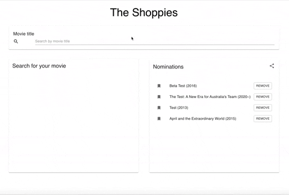

# Notes to Consider

This project was created for the Shopify Front-end Internship Application.
[Visit the hosted app through this link](https://tranquil-island-31035.herokuapp.com)

## Available Scripts

To test this project in the development mode, please clone this repo and run:

### `npm install`

Install all the dependencies in this repo. The important ones are:
- `axios` for fetching from the OMDB Api;
- `local-storage` for saving the list of nominees when refresh the page or open the page in a new tab;
- `react-router-dom` for creating a sharable link for the list of nominees
- `@material-ui/core` for the css library

### `yarn start`

Runs the app in the development mode.\
Open [http://localhost:3000](http://localhost:3000) to view it in the browser.

The page will reload if you make edits.\
You will also see any lint errors in the console.

## Featured Functions

Apart from the technical requriements, I complemented with the ability to save the nomination list and create a sharable list for the nominations.

- This app uses React.js Hooks to manage the state. Because the functions are quite simple, Redux was avoided to reduce unnecessary complexity. (For example of a Redux app, [please visit](https://github.com/Maloochow/movie_swipe))
- For the search bar, to save the step of clicking a submit button, a timeout function was setup to detect when the user stops typing. When the user stops typing, the input value was sent in a fetch request to the OMDB api.
- The localStorage on browser is utilized to store the details of nominated moviea.
- To generate a sharable link, the app uses a serializer method to store the `imdbID` of each nominated movie as parameters in the generated URL.
- `useEffect` was used to handle the fetches for updating the content of the sharable links.
- Style-wise, this app uses material-ui library for the responsive UI.